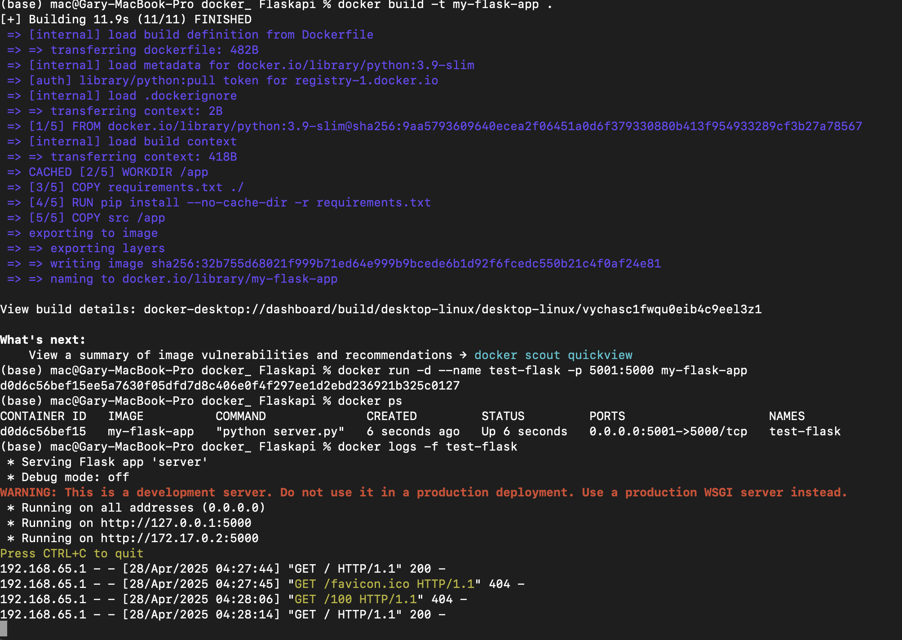
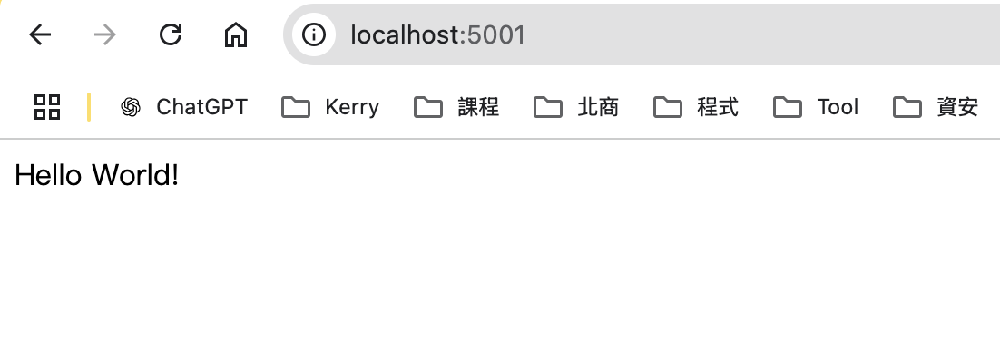

# docker_flaskapi

本專案為練習使用 Docker 打包並執行 Flask API 的範例。

## 使用說明

### 建立映像檔 (Image)

```sh
docker build -t my-flask-app .
```

- -t：為映像檔指定名稱（tag name）

### 檢查映像檔
```sh
docker images
```
### 建立並啟動容器
```sh
docker run -d --name test-flask -p 5001:5000 my-flask-app
```
- -d：以背景（detached）模式執行容器  
- --name：為容器命名（此處為 test-flask）  
- -p 5001:5000：將主機的 5001 port 映射至容器的 5000 port（Flask 預設執行於 5000）

### 檢查容器狀態
```sh
docker ps -a
```
### 查看容器日誌
```sh
docker logs -f test-flask
```
### 停止容器
```sh
docker stop <container_id>
```
### 刪除容器
```sh
docker rm <container_id>
```
### 刪除映像檔
```sh
docker rmi <image_id>
```
※ 小提示：可透過 `docker ps` 與 `docker images` 查詢正確的 container/image ID

## 執行成果

- 指令執行結果

 

- API執行結果




## TODO

- [ ] 整合監控：使用 Prometheus + Grafana 建立系統儀表板  
- [ ] 加入 Health Check 功能  
- [ ] 改用 Podman 重構服務環境  
- [ ] 建立 CI/CD 流程，自動化建構、測試與部署
